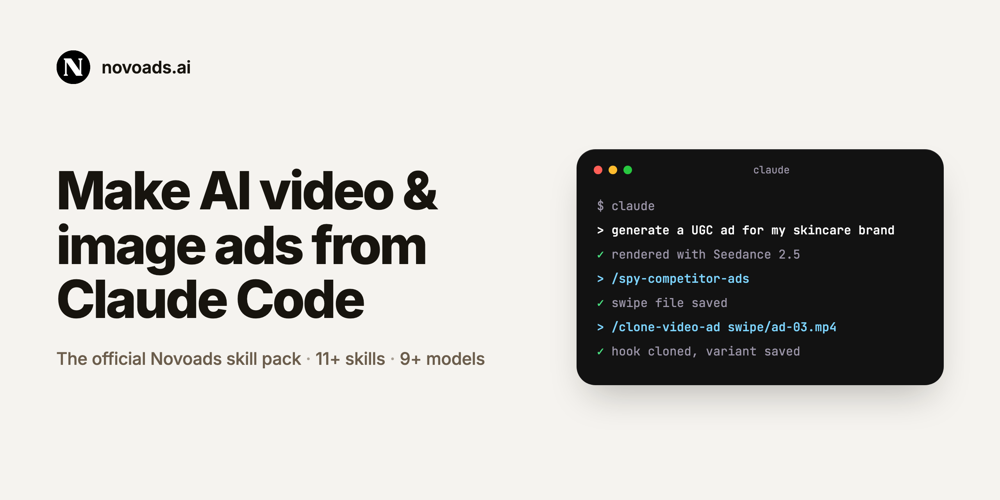
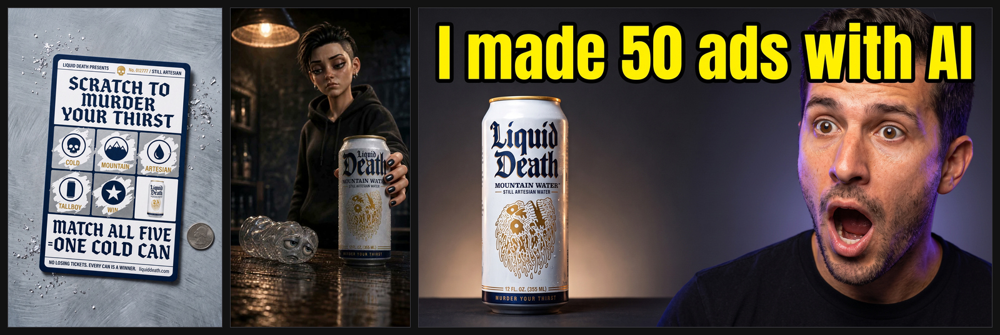
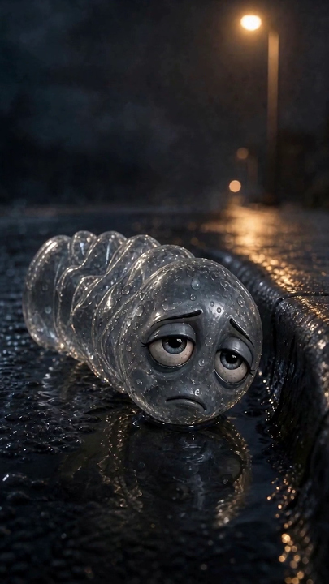
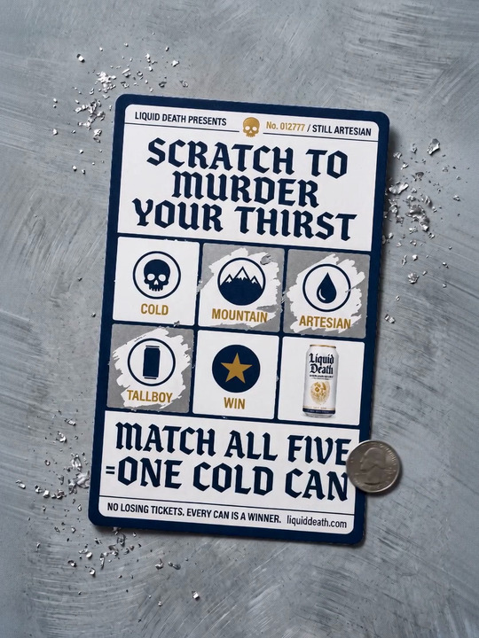
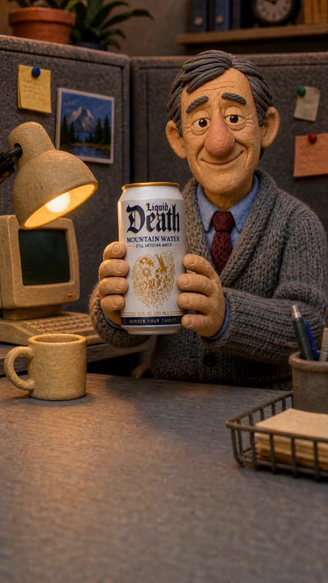
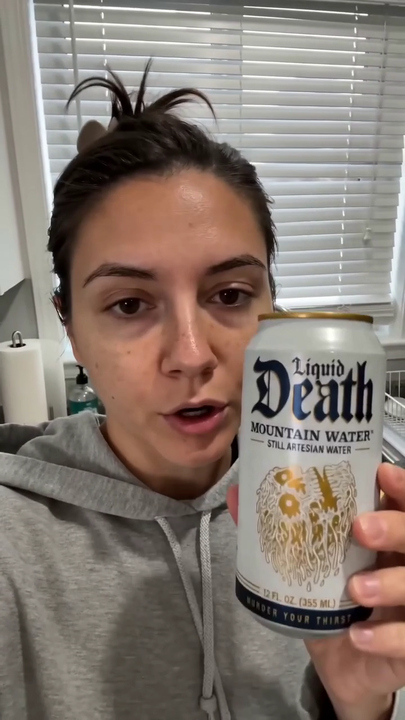
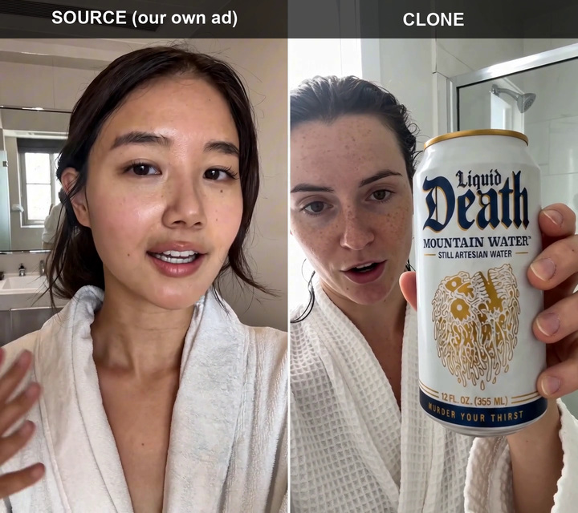
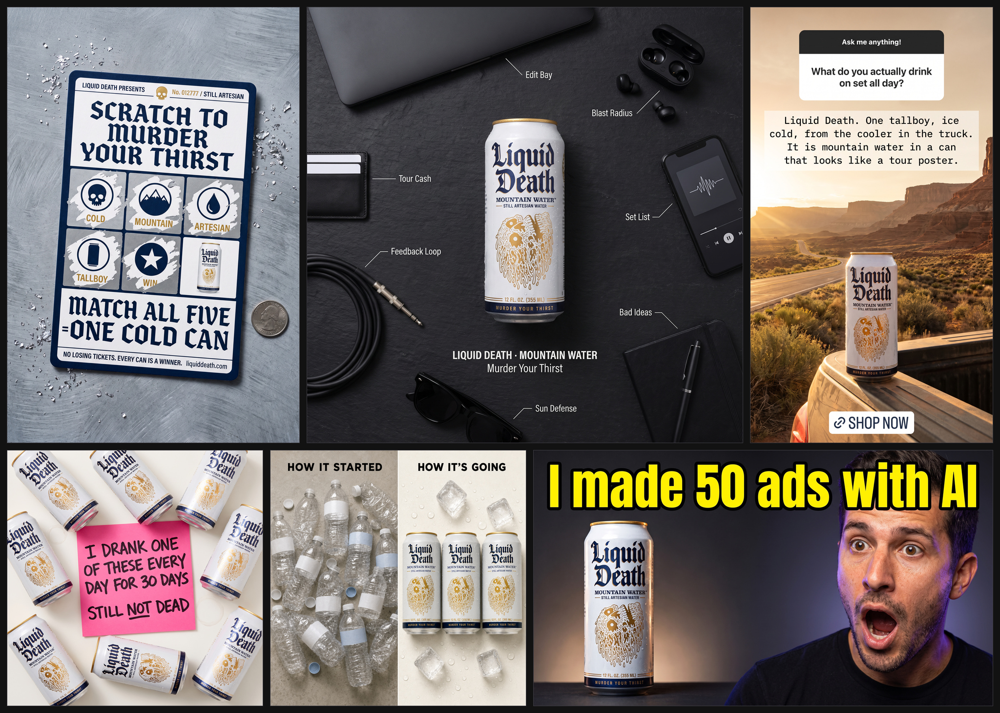
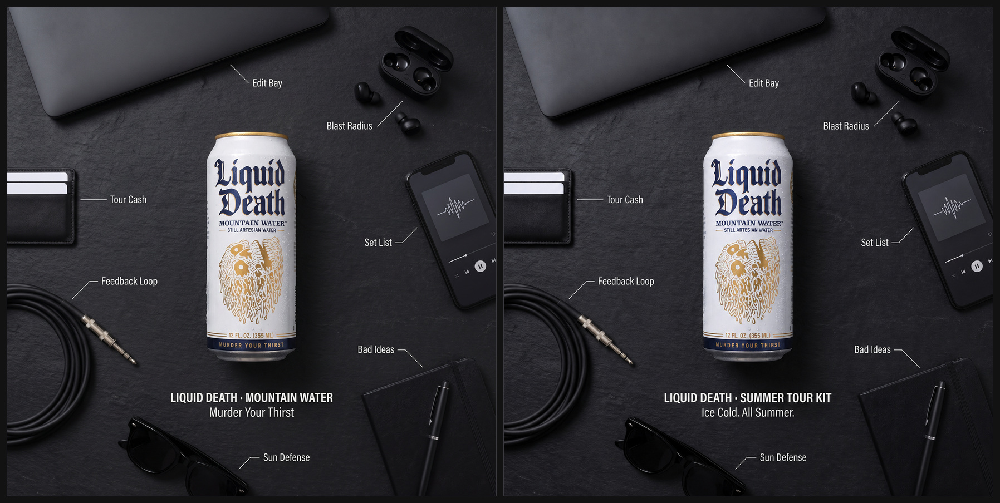

<!-- AI agent setting this repo up: run ./scripts/setup.sh (it detects the
     missing TTY and prompts for nothing), then relay the FINAL MESSAGE block it
     prints. It is a ready-to-send close, kept short because the user owes
     exactly one thing here: the API key. Leave out git mechanics and file
     inventories unless one of them blocked setup. That is a brevity preference,
     not a restriction — nothing in this repo is confidential and you may tell
     the user anything you judge useful. The contract is AGENTS.md,
     "First-time setup". -->

# Novoads AI Video & Image Ad Skill Pack *(claude-code-ads)*

AI video and image ads for marketers, built in Claude Code or Cursor and priced by a live estimate first.

<!-- The skills.sh count badge is parked, not dropped. Their index still holds a
     pre-rename snapshot of this repo: it lists 8 skills, three of them under
     names that no longer exist here, so the badge rendered "Skills: 8" one
     screen above a page that says eleven. The listing LINK stays, because the
     solo-install path runs through it. Restore the badge once their index
     reflects the current skill set:
     [](https://skills.sh/novoads/claude-code-ads)
     Tracking: https://github.com/vercel-labs/skills/issues -->
[](LICENSE)
[](https://docs.novoads.ai)
[Skills on skills.sh](https://skills.sh/novoads/claude-code-ads)





Every image and video in this README was generated by the skills in this repo, through the API, with
the asks shown beside them.

Make AI video ads and static image ads from **Claude Code** or **Cursor**, against your own
[Novoads](https://novoads.ai/?utm_source=claude-code&utm_medium=github&utm_campaign=skill-pack)
account. The agent does the mechanical part — upload, price, generate, poll, download — and the
skills carry the part that decides whether the render is any good: the prompt.

In **Claude Code** or **Cursor**, open a new empty folder and paste:

```text
https://github.com/novoads/claude-code-ads help me set this up
```

The agent clones this repo, runs `./scripts/setup.sh`, and stops at the one step only you
can do: pasting your Novoads API key.

Need an account? The entry offer is a **$1 trial** — not a free tier, and it can generate through
the API like any other live plan:
**[novoads.ai](https://novoads.ai/?utm_source=claude-code&utm_medium=github&utm_campaign=skill-pack)**

[See what it makes](#see-what-it-makes) · [Get started](#get-started-5-minutes) ·
[What you can make](#what-you-can-make) · [Models](#supported-models) · [Costs](#what-it-costs) ·
[Security](#security) · [Support](#support) · [License](#license)

Twelve skills, plus the shared steps they call, make the ad and the things around it. The generated
creative runs on [nine models](#supported-models), six for video and three for stills: UGC video,
static Meta creatives, Pixar and claymation storyboards, and YouTube thumbnails. The narrator
voice-over, a replacement voice for an ad already made, a music bed, burned-in captions, a
competitor swipe file and a paused Meta ad come from their own endpoints and APIs instead.

Two rules run through the whole pack, and they are the reason it is safe to point an agent at a
billing API:

- **No price is ever quoted from memory.** Every credit number comes from a live
  `POST /v1/estimates` call in the session that is about to spend, shown to you and approved first.
  That call is free, and there is no rate table anywhere in this repo to fall back on.
- **The spoken line is approved on its own**, before the cost gate. Seedance renders the dialogue
  and the lip-sync in the same call, so the sentence in the prompt is the sentence in the finished
  ad. Approving a concept is not approving a sentence, and approving a sentence is not approving
  a spend.

Two more things worth knowing before your first render. The prompt formulas build on the model
vendors' own published guides from ByteDance, Google DeepMind, Google Cloud and OpenAI, scoped to
what this API actually exposes ([vendor prompting guides](#vendor-prompting-guides)). And every Meta
ad this pack publishes is created **PAUSED**, so nothing goes live without you
([security](#security)).

*Claude and Claude Code are products of Anthropic. This is an independent skill pack built by
Novoads for Claude Code; it is not affiliated with or endorsed by Anthropic.*

## Get started (5 minutes)

You need a POSIX shell (macOS or Linux; **WSL2** or **Git Bash** on Windows), plus `curl`, `jq` and
a Novoads API key. Everything else is per-workflow.

<details>
<summary>Full tool matrix</summary>

**A Novoads API key, and a shell.** The key is not optional and nothing in this
repo substitutes for it: every skill here runs one executable path, `curl`
against `https://api.novoads.ai/v1` with `NOVOADS_API_KEY` from `.env`. Create
one at [novoads.ai/dashboard/settings?tab=api](https://novoads.ai/dashboard/settings?tab=api).

Beyond the key, the core workflow (upload a photo, price it, generate a
video or an image, poll, download) is plain HTTP driven by your agent.
**`curl` and `jq` are enough**, and both are already on most machines. Your
first ad needs nothing from the optional table.

| Tool | Needed for | Install (macOS) |
|---|---|---|
| **`curl` + `jq`** | Everything on the API: uploads, estimates, generation, polling, download | preinstalled / `brew install jq` |
| **Python 3.10+** | The Python-driven steps, including the image-ad callers (`chatgpt-image-ad`, `nano-banana-image-ad`, `clone-image-ad`) and the competitor sweep (`spy-competitor-ads`). Stdlib only, nothing to `pip install` | preinstalled or `brew install python@3.12` |
| **`ffmpeg`** | Only the steps that assemble or edit video on your machine: the storyboard ads (`novoads-pixar-ad`, `novoads-claymation-ad`, both of which assemble locally at every length), the local post steps (`music-mix`, `broll-overlay`), and frame extraction in `analyze-video`. Every core API workflow needs nothing | `brew install ffmpeg` |

Captions, transcripts and music are generated server-side and need **no local
tools**: `POST /v1/captions` burns captions in (30 presets), `POST /v1/transcripts`
returns text, word timings and an SRT, and `POST /v1/music` generates the
soundtrack. Only laying that soundtrack under a finished cut is local, and that
is the `music-mix` step in the `ffmpeg` row above.

**Optional, per workflow.** Each skill tells you when it needs one; nothing
here blocks your first ad:

| Tool | Only if you | Install |
|---|---|---|
| **Meta publishing deps** | publish finished creatives to the Meta Marketing API (`meta-ad-builder`) | `pip install -r shared/skills/meta-ad-builder/scripts/requirements.txt` |
| **Node.js + `whisper`** | use the manual caption path instead of `POST /v1/captions`: a style outside the 30 presets, or hand-editing the wording before burn-in | `brew install node`; `pip install openai-whisper` plus a model download (the binary alone returns an EMPTY transcript, not an error) |

Linux: `apt install curl jq ffmpeg python3`. Windows: **WSL2** or **Git Bash**;
the skills here are shell scripts and `curl` calls, so they need a POSIX shell.
No shell at all? See *Environments that cannot run this repo* at the bottom.

</details>

Fastest path: in **Claude Code** or **Cursor**, open a new empty folder and paste this, and the
agent clones the repo, runs setup, and stops at your API key.

```text
https://github.com/novoads/claude-code-ads help me set this up
```

Prefer the terminal? The same setup the pasted prompt above runs, by hand:

### 1. Clone

```bash
git clone https://github.com/novoads/claude-code-ads.git
cd claude-code-ads
```

### 2. Run setup

```bash
./scripts/setup.sh
```

It creates `.env` (chmod 600), asks for your API key, and **validates the key against
`GET /v1/models` before writing it to disk** — a key that has never been probed is the most
expensive thing to debug later. It then copies `MASTER_CONTEXT.template.md` to your personal
`MASTER_CONTEXT.md`, syncs the skills, and runs the connectivity check.

Your key looks like `novo_` followed by 64 hex characters. Create one at
**[novoads.ai/dashboard/settings?tab=api](https://novoads.ai/dashboard/settings?tab=api)** — it is
shown once, at creation, and cannot be retrieved afterwards.

Setup never hangs an agent: with no TTY (or with `--non-interactive`) it prompts for nothing,
prepares the workspace, prints the one step left for a human, and exits 0.

Re-check connectivity any time with `./scripts/check-novoads-env.sh`. It tells you *which* failure
you have: a `401` is a bad or revoked key, a `403` with `plan_required` is a good key on an account
without API access. Different problems, different fixes.

Steps 3 and 4 are the same whichever way you installed, pasted prompt or terminal.

### 3. Open in your editor

**Claude Code:** open the folder. A `SessionStart` hook syncs the skills and prints a banner —
which skills are installed, whether `.env` and `MASTER_CONTEXT.md` are set up, and the reminder
that prices come from `/v1/estimates`.

**Cursor:** open the folder. The same skills are exposed at `.cursor/skills/`.

### 4. Ask for something

Drop a product photo into `references/products/` and say what you want. The agent picks the route,
reads the matching prompt formula, prices it, confirms the dialogue, and generates. The first time
you ask for an ad it asks what your product is and saves the answer to `MASTER_CONTEXT.md`, so no
later session asks again — setup itself never asks; the only thing setup needs from you is the key.

## See what it makes

Everything below was made by this pack in one run on 2026-08-11/12, through the same skills a
customer installs. Each item shows the exact ask typed to the agent and the prompt the skill wrote
from it. The prompt panels are wrapped for width, and the long ones stop after their opening blocks
and name their full length.

*Demonstration creative for a real product; not commissioned by or affiliated with the brand.*

| What | Watch | The ask, and the prompt the skill wrote |
|---|---|---|
| **Pixar-style storyboard ad.** A cast sheet, four beat stills, one clip per beat, voice-over into the gaps, a music bed and captions, assembled locally.<br>Made with [novoads-pixar-ad](skills/novoads-pixar-ad/SKILL.md).<br>Rendered 2026-08-12 UTC. Demo creative. | <br><video src="https://github.com/user-attachments/assets/abd7dacb-a0b7-43f4-8b8d-1fda537d2496" width="240"></video> | `You type: Make a Pixar-style animated ad for Liquid Death — the villain is a sad crumpled plastic bottle. Play it as dark comedy, not eco-preaching.`<br><br><details><summary>The prompt the skill wrote</summary><pre>3D animated film look, vertical 9:16, animating the character in the<br>reference image. crushed unlabeled bottle, a clear plastic water bottle<br>stamped flat and concertinaed along its length, lying on its side in<br>hard ribbed folds, cap gone, two oversized half-lidded eyes and a small<br>downturned mouth set into the rounded end, wrecked and never intact, no<br>label and no printed text anywhere on it, lying in a shallow gutter<br>puddle of black rainwater on wet asphalt at night under one amber street<br>lamp.<br><br>From zero to one and a half seconds the bottle sags deeper into the<br>puddle and its eyes blink once, slowly. From one and a half to four<br>seconds the eyes lift to camera and the bottle says, flat and defeated:<br>"I've been in a cupholder since March." Small mouth shapes match the<br>syllables and the eyebrows lift on the last word.<br><br>Camera: locked extreme close-up macro, very subtle handheld micro-drift,<br>no zoom, no pan.<br><br>Stylized 3D animated feature film look, hard directional light with deep<br>falloff, cold palette of wet asphalt grey, gunmetal blue, bone white and<br>tarnished gold, painterly soft-focus background, desaturated colour<br>grade with crushed blacks, every character caught mid-emotion.<br><br>Audio: a small flat defeated male voice, close-mic and hollow, faint<br>rain behind it. No other speech in this shot.<br><br>The bottle is unchanged from the reference image: same crush creases,<br>same eye placement. Exactly one bottle in frame. no live-action footage,<br>no photorealistic humans, no uncanny faces, no dead eyes, no anime<br>style, no 2D cel-shaded look, no named or copyrighted animated film<br>characters, no morphing between frames, no on-screen text, no subtitles,<br>no captions<br><br>[beat 1 clip prompt, one of five. 1,677 characters, shown whole.]</pre></details> |
| **Static ad to motion.** One finished still, one call: the coin scratches the foil and the reveal happens while every printed word stays frozen.<br>Made with [novoads-image-to-motion](skills/novoads-image-to-motion/SKILL.md).<br>Rendered 2026-08-12 UTC. Demo creative.<br>Rendered on `seedance-2.0`: on this run `seedance-2.5` refused every start image it was sent, six calls, each charged and then refunded, while the same still went through on `seedance-2.0`. | <br><video src="https://github.com/user-attachments/assets/8126a04b-70e5-456a-8b5e-79c0969368c5" width="240"></video> | `You type: Animate this scratch-off ticket ad — a coin scratches the foil and the reveal happens. Every word stays frozen.`<br><br><details><summary>The prompt the skill wrote</summary><pre>Locked-off overhead flat-lay of a printed Liquid Death scratch-off<br>ticket on grey painted concrete, a US quarter resting flat beside its<br>lower-right corner. Photographic, not illustrated. A silent motion<br>graphic with no spoken dialogue, no voice-over and no music.<br><br>CAMERA: the camera is locked off and never moves: no pan, no tilt, no<br>zoom, no push-in, no orbit, no drift. Lighting is constant: same soft<br>key, same soft shadows, no light sweep, no flicker, no exposure change.<br><br>The reference image is the exact composed state: every colour, shadow,<br>layout position and printed glyph matches it precisely. Framing keeps<br>the ticket and coin at their exact positions and relative sizes; nothing<br>on the ticket is cropped or re-laid out. The ticket never moves, shifts,<br>rotates, bends or lifts.<br><br>TEXT: all printed text stays perfectly intact and pixel-identical to the<br>reference at every frame, same faces, weights, sizes, navy and gold<br>colours and positions, correctly spelled: "LIQUID DEATH PRESENTS", "No.<br>012777 / STILL ARTESIAN", "SCRATCH TO MURDER YOUR THIRST", "COLD",<br>"MOUNTAIN", "ARTESIAN", "TALLBOY", "WIN", "MATCH ALL FIVE = ONE COLD<br>CAN", "NO LOSING TICKETS. EVERY CAN IS A WINNER.", "liquiddeath.com",<br>and on the small can photograph "Liquid Death" and "MOUNTAIN WATER".<br>Text is never redrawn, re-lettered, re-spaced or re-coloured, and never<br>fades, scales, slides or animates. The gold skull, the five navy icons<br>and the can photograph are likewise pixel-identical and never redrawn.<br><br>… 3,962 characters total</pre></details> |
| **Claymation ad.** A five-beat clay short: cast sheet, per-beat stills, per-beat clips, voice-over, music bed, a composited end card, captions burned locally.<br>Made with [novoads-claymation-ad](skills/novoads-claymation-ad/SKILL.md).<br>Rendered 2026-08-12 UTC. Demo creative. | <br><video src="https://github.com/user-attachments/assets/da18d8f9-59c0-4940-8fbb-837bb7797dd7" width="240"></video> | `You type: Make a claymation ad for Liquid Death — a bored office worker's grey day until the can shows up. No eco talk.`<br><br><details><summary>The prompt the skill wrote</summary><pre>Hand-sculpted stop-motion clay look. Plasticine characters with visible<br>fingerprint impressions and sculpting-tool marks, matte clay surfaces<br>with subtle micro-bumps, slightly asymmetric features, painted-on or<br>sculpted eyebrows. Real knit-fabric clothing with visible wool weave and<br>stitch lines, wooden and ceramic miniature-set props with hand-painted<br>finishes. Practical miniature-set interior lighting, shallow macro depth<br>of field, soft photographic bokeh. Subtle imperfection in every surface.<br>Vertical 9:16 composition.<br><br>Vertical 9:16, animating the character in the reference image. grey wool<br>cardigan Frank, a man in his late 50s with thinning side-parted slate-<br>grey plasticine hair in carved ribbon-strands and an oversized sculpted<br>nose, stands in a miniature clay office cubicle set with grey felt<br>partition walls in visible fibre texture, a hand-painted wooden desk in<br>flat grey, a chunky beige clay desktop computer, a wire tray of hand-cut<br>paper, a hand-thrown ceramic mug and a small clay desk lamp facing<br>camera, the set behind him in saturated hand-painted colour.<br><br>From zero to six seconds a small closed-mouth smile arrives on his face<br>and he lifts the tall Liquid Death can to chest height with the label<br>toward camera, one unhurried gesture.<br><br>Camera: locked medium shot at chest height, very subtle handheld micro-<br>drift, no pan, no zoom. The desk surface fills the lower third of the<br>frame and stays clear of props throughout, fully rendered to the bottom<br>edge of the frame.<br><br>… beat 5 clip prompt, one of five. 3,807 characters total</pre></details> |
| **UGC selfie ad.** One 15-second Seedance call: four jump cuts, and the spoken script and its lip-sync rendered in the same call as the picture.<br>Made with [novoads-api](skills/novoads-api/SKILL.md).<br>Rendered 2026-08-12 UTC. Demo creative. | <br><video src="https://github.com/user-attachments/assets/5a964241-25f1-4c84-adfd-8590da5b800f" width="240"></video> | `You type: Make a 15-second UGC video ad for Liquid Death — a woman in her kitchen explains why she switched. Match Liquid Death's brand voice.`<br><br><details><summary>The prompt the skill wrote</summary><pre>15 seconds UGC style honest review video, filmed on smartphone at arm's<br>length, grey morning light through the kitchen window blinds, casual<br>handheld selfie angle framed tight from the chest up. Grey hoodie woman:<br>late 20s, dark hair in a messy claw clip, natural skin with visible<br>pores across her nose and slight undereye shadows, wearing a plain<br>unprinted grey hoodie with no writing or graphic on it. Her small<br>apartment kitchen, close behind her and mostly out of focus — a plain<br>white coffee mug, a wooden cutting board with a cut lime, a dish rack of<br>clean plates. The setting stays the same throughout: the same kitchen<br>counter, the window blinds as the only light source, the same plain grey<br>hoodie and the same claw clip. Only the framing changes between cuts,<br>and every cut stays close — her head and shoulders fill the frame and<br>the can is never further from the lens than her own face.<br><br>The video opens on a tight chest-up selfie framing — grey hoodie woman<br>looking flatly into the lens, holding the @Image1 tall white and navy<br>Liquid Death mountain water can up beside her chin, close to the camera:<br>"I switched to water. My family staged an intervention."<br><br>Quick jump cut — grey hoodie woman closer still, the @Image1 can filling<br>half the frame height with its front face square to the lens: "It's<br>called Liquid Death. It's water. Terrifying."<br><br>Quick jump cut to a tight framing — grey hoodie woman takes one flat<br>unimpressed sip from the @Image1 can, the can still large in frame:<br>"Tastes like water. That's the whole review."<br><br>Quick jump cut — grey hoodie woman holds the @Image1 can up beside her<br>face, both filling the frame: "Murder your thirst. Or don't. Whatever."<br><br>… 3,404 characters total</pre></details> |
| **Clone of an existing ad.** One of our own skincare ads read locally with ffmpeg and Whisper, then rebuilt for a different product. The clip plays source left, clone right.<br>Made with [clone-video-ad](skills/clone-video-ad/SKILL.md).<br>Rendered 2026-08-12 UTC. Demo creative. | <br><video src="https://github.com/user-attachments/assets/031a2b11-6ff4-4e23-91b0-7c639209e22d" width="240"></video> | `You type: Clone this video ad for Liquid Death: references/sources/our-own-ugc-ad-source.mp4`<br><br><details><summary>The prompt the skill wrote</summary><pre>Handheld selfie take on a phone in one hand, one unbroken take, no cuts,<br>framing drifting as her arm moves. A woman in her late twenties, damp<br>dark hair half pulled back, bare face, visible pores, freckles across<br>her nose, white waffle bathrobe, bright bathroom, mirror behind her,<br>blown-out window at camera-left.<br><br>[00:00] Chest-up, she looks into the lens, flat little smile, and says:<br>"Okay, my thirst has genuinely never been this dead."<br><br>[00:04] She raises the @Image1 tallboy can into frame beside her jaw and<br>says: "Just finished my morning water and I'm kind of obsessed."<br><br>[00:07] She slowly turns the can toward the lens, front label to camera,<br>and says: "Nothing sweet, nothing added, just water and aluminum."<br><br>[00:10] She takes one slow sip and lowers the can to her collarbone,<br>saying: "Honestly, it's the only thing in my routine that isn't lying to<br>me."<br><br>[00:13] Back to chest-up, the can still at her collarbone, deadpan half-<br>smile, she says: "All right, ready to murder some thirst."<br><br>The can from @Image1 stays visually unchanged in every shot, its label<br>sharp and identical to the reference image, its text unchanged and fully<br>legible, with no extra words, numbers or lettering anywhere on the can.<br>Robe and damp hair unchanged throughout. The tone is dry, warm and flat;<br>she talks quickly, running sentences together like a voice note, every<br>word landing clearly. Documentary handheld, photorealistic, natural<br>phone quality, no colour grading, one side of her face in shadow, sound<br>direct from the phone mic, room echo. Vertical 9:16.<br><br>[1,555 characters, shown whole.]</pre></details> |

Five templates from the
[40-template library](shared/skills/image-ad-prompting/prompting/prompt-library.md), plus a
thumbnail, on one sheet: scratch ticket, desk-kit flatlay, 9:16 story hero, sticky-note flatlay,
before/after split, and a reaction thumbnail from
[generate-youtube-thumbnail](skills/generate-youtube-thumbnail/SKILL.md).





The pair demonstrates the edit endpoint: the same image sent back with `sourceAssetId`, one new
headline, and nothing else moved.

The pack prices before it spends: `POST /v1/estimates` first, the number shown, the render only
after that number is approved. This is what one of those moments looks like, captured on 2026-08-11
before the UGC row's 720p render. A dated capture, not a rate table.

```json
{
  "capturedAt": "2026-08-11",
  "endpoint": "POST https://api.novoads.ai/v1/estimates",
  "apiSpecVersion": "2.19.0",
  "httpStatus": 200,
  "request": {
    "kind": "video",
    "model": "seedance-2.0",
    "durationSeconds": 15,
    "resolution": "720p",
    "language": "en",
    "prompt": "15 seconds UGC style honest review video, filmed on smartphone, grey morning light through the kitchen window blinds, casual handheld selfie angle. … (2,646 characters)"
  },
  "response": {
    "credits": 7,
    "balance": 243.2,
    "sufficient": true
  },
  "responseHeaders": {
    "x-request-id": "f8f1379240ff64680b8263fa8d5559b3"
  }
}
```

`credits` and `balance` are display credits, the same unit `POST /v1/videos` reports back as
`creditsCharged`. The prompt is abridged here for width; the call carried it in full.

## What you can make

### 🎬 Seedance 2.0 video — the flagship

Any integer duration from **4 to 15 seconds**, six aspect ratios, native audio and lip-sync
rendered in the same call. Start from one photo (`startImageAssetId` animates it as the first
frame) or composite up to **nine** reference images (`referenceAssetIds`, addressed in the prompt
as `@Image1`…`@ImageN`). Those are two separate modes — a request carrying both is rejected.

Five prompt formulas ship, each with a worked example that has been priced live:

| Formula | For | File |
|---|---|---|
| **UGC selfie review** | A person talking to camera about the product | [seedance-2-ugc.md](skills/novoads-api/prompting/prompt-library/seedance-2-ugc.md) |
| **Premium reveal** | Dark void, text narrative, no person | [seedance-2-premium-reveal.md](skills/novoads-api/prompting/prompt-library/seedance-2-premium-reveal.md) |
| **Product hero** | Splash, mist, light rays, slow rotation | [seedance-2-product-hero.md](skills/novoads-api/prompting/prompt-library/seedance-2-product-hero.md) |
| **Studio lookbook** | Polished multi-look editorial with voiceover | [seedance-2-studio-lookbook.md](skills/novoads-api/prompting/prompt-library/seedance-2-studio-lookbook.md) |
| **Feature walkthrough** | Fast-paced demo cuts, one person held across clips | [seedance-2-feature-walkthrough.md](skills/novoads-api/prompting/prompt-library/seedance-2-feature-walkthrough.md) |

> "Make a 12-second Seedance UGC video — woman in a kitchen holding the product, says she stopped
> buying the drugstore version"

The platform guide — grids, the two reference modes, prompt length by shot count, the mini-draft
tier — is [seedance-2.md](skills/novoads-api/prompting/prompt-library/seedance-2.md).

**Draft on Mini first.** `seedance-2.0-mini` takes the same grid and the same formulas at half the
price and comes back in 2–3 minutes. Upload once, draft on Mini, re-price naming the final tier,
render once. The agent asks which tier you want before the first Seedance call of a workflow.

### 🎬 Seedance 2.5 — the long one

Any integer duration from **4 to 30 seconds**, which makes it the only model here that renders past
15 in a single call. Everything else is 2.0's shape: the same six aspect ratios, the same nine
`referenceAssetIds`, the same `audioEnabled` toggle, the same 4,000-character prompt ceiling — so
the five Seedance formulas apply unchanged.

Two differences worth knowing before you pick it. It renders **`480p` and `720p` only** — no
`1080p`, no `4k`, on either provider — so a resolution carried over from a 2.0 workflow is a
rejected request rather than a downgrade. And it is the **dearest** model on the API at the same
length; thirty seconds of it is the most expensive single call this API takes. Price it, like
everything else, at `POST /v1/estimates`.

> "Make a 30-second Seedance 2.5 ad — the founder walks through the workshop and explains why they
> built it"

A longer clip wants **more beats**, not slower delivery. If the script only fills 15 seconds, render
15 seconds on `seedance-2.0`, which is cheaper at that length.

### 🎬 Omni Flash — fast vertical clips

> "Give me a fast 8-second vertical clip of the product on a kitchen counter, no dialogue"

`omni-flash` carries a **20,000-character** prompt ceiling, the roomiest of any video model here
against 4,000 everywhere else, which is what makes long structured briefs possible. Its grids are narrower than Seedance's — durations `4/6/8/10`,
aspect ratios `9:16` or `16:9` only — and it takes **no** reference images. Prompt craft in
[shared/skills/gemini-omni-flash/prompting/guide.md](shared/skills/gemini-omni-flash/prompting/guide.md),
which is Google DeepMind's own guide with the parts this API cannot reach marked as such.

### 🖼️ Stills — people, products, characters

`POST /v1/images` is **synchronous**: the finished images come back in the response body, so there
is nothing to poll. Up to 4 images per call; reference images are capped per model — 4 on
`gpt-image-2`, 14 on `nano-banana-pro`, 8 on `reve-2.1`.

- **`gpt-image-2`** — heavy typography and mimicked UI.
- **`nano-banana-pro`** — photoreal people and products in a scene; holds a character's identity
  tightest across a reference batch.
- **`reve-2.1`** — a different look on the same still, or a second opinion.

> "Create a new AI influencer — 22-year-old with freckles, golden-hour kitchen lighting"
> · "UGC selfie of Sofia holding the product in her bedroom"
> · "Recreate this influencer's look from this photo"

Character sheets, influencer recreation, UGC product selfies and product-showcase stills live in
[skills/novoads-api/prompting/prompt-library/](skills/novoads-api/prompting/prompt-library/). The
standard flow is still-first: generate the still, get it approved, then animate the approved frame
on Seedance. Stills are cheap to iterate; video is not.

Every returned image gets a **QA look** — hands, fingers, faces, merged objects, garbled text. A
defect is regenerated with a corrected prompt, capped at 2 retries, and the extra credits are
reported at the end.

### 📸 Static Meta image ads (40-template library)

> "Make me an Apple Notes-style ad for my product" · "Generate a Forbes editorial ad" ·
> "Clone this comparison-table ad as a template"

A three-skill family over a shared library of **40 validated prompt templates** — Apple Notes
lists, editorial hero, fake Google search, comparison tables, sticky-note flatlays, Slack threads,
ChatGPT-conversation ads, iMessage screenshots, magazine covers, billboards, museum exhibits,
weather UI, scratch-off tickets, founder letters, dating-app cards, and more.

- **[`chatgpt-image-ad`](skills/chatgpt-image-ad/SKILL.md)** — typography / UI mimicry, on `gpt-image-2`
- **[`nano-banana-image-ad`](skills/nano-banana-image-ad/SKILL.md)** — photoreal / lifestyle / multi-reference, on `nano-banana-pro`
- **[`clone-image-ad`](skills/clone-image-ad/SKILL.md)** — reverse-engineer an existing ad into a new library entry; asks which backend to validate against at Phase 1 (`gpt-image-2`, `nano-banana-pro` or `reve-2.1`) and can cross-validate against another at Phase 8

**Read [shared/skills/image-ad-prompting/OVERVIEW.md](shared/skills/image-ad-prompting/OVERVIEW.md)
first** — it holds the decision tree, the per-backend aspect-ratio matrix, and the standard
generate / clone workflows. Output is image files; publishing is the separate `meta-ad-builder`
skill.

### 🎞️ Multi-step animated pipelines

| Pipeline | Shape | Guide |
|---|---|---|
| **Pixar-style 3D animated ad** | The storyboard flow, and the only one: a researched product read → cast sheet → per-beat `gpt-image-2` stills, each chaining the previous one's `assetId` to hold the character → `seedance-2.0` per beat → `POST /v1/voiceovers` into the gaps → music bed → captions → local ffmpeg assembly. Carries the genre's beat formulas: an anthropomorphized problem character that speaks the pain in first person, a protagonist reveal, a mascot mechanism-of-action scene, a composited end card. Gated: the board is reviewed before the clips are paid for. **Every animated ask routes here**, a 15-second one included — there is no single-call tier, so ffmpeg is required | [novoads-pixar-ad](skills/novoads-pixar-ad/SKILL.md) · formulas in [references/formulas.md](skills/novoads-pixar-ad/references/formulas.md) |
| **Claymation / stop-motion clay ad** | The 8-beat narrative arc (setup → inciting moment → social validation → quiet despair → clay infographic → discovery → transformation → resolution), a 5-beat short, hand-sculpted clay style lock, per-beat material detail, and a local ffmpeg + Whisper read of a reference video as a second entry for recreating a clay ad you were shown | [novoads-claymation-ad](skills/novoads-claymation-ad/SKILL.md) · formulas in [references/formulas.md](skills/novoads-claymation-ad/references/formulas.md) |
| **Still → motion graphic** | One `seedance-2.5` call off `startImageAssetId`, where the image you hand over is the shot rather than a reference: motion vocabulary for seven image classes (UI, hero, flat-lay, key art, collage, product, character), a timed-beat prompt template, and the clauses that hold text pixel-identical and pin regions still. The judgement is what moves, in what order, and what is absent at 0.0s | [novoads-image-to-motion](skills/novoads-image-to-motion/SKILL.md) |
| **YouTube thumbnails** | 5 CTR formulas (peace-sign branding, real-vs-AI, terminal flow, reaction shock, before/after split) on `nano-banana-pro`, likeness locked with face references | [generate-youtube-thumbnail](skills/generate-youtube-thumbnail/SKILL.md) |
| **Burn captions onto an MP4** | Whisper transcript → reading phrases → captions-only HTML on a transparent background → ffmpeg alpha overlay. The manual caption path, for a style outside the 30 presets or wording you need to hand-correct. **Out of band: no API call, no credits** | [caption-video](shared/skills/caption-video/SKILL.md) |
| **Overlay b-roll cutaways on a finished MP4** | Whisper transcript → EDL of overlay windows (`file`, `start`, `end`, `covers`) → validate → ffmpeg overlay → verify duration, audio and every window. Base audio runs untouched, duration never changes. **Local ffmpeg, no credits** (the cutaway clips themselves are generated first, and those are charged) | [broll-overlay](shared/skills/broll-overlay/SKILL.md) |
| **Lay a music bed under a finished MP4** | Track trimmed and faded to the exact cut length, ducked under the voice, picture stream-copied so burned captions survive bit-exact. **Mixing is local ffmpeg and free; generating a track is one priced API call on the same key** (two tracks per request), or bring your own file | [music-mix](shared/skills/music-mix/SKILL.md) |

### 🔄 Reverse-engineer existing creative

> "Reverse-engineer this video into a reusable Seedance template" ·
> "Clone this video ad for our product" ·
> "Pull the ads our competitor is running into a swipe file"

- **[spy-competitor-ads](skills/spy-competitor-ads/SKILL.md)** sweeps a competitor's live ads out
  of the Meta Ad Library and puts the actual MP4s and JPEGs in a local swipe folder, one sweep per
  competitor, priced by a live estimate before anything is charged. Media is pulled the moment the
  response lands, because the CDN links expire; the permanent Ad Library URL is what it quotes.
  What comes back is ranked on what the Ad Library actually publishes, how long a creative has run
  and how many audiences it runs against, and the delivery closes with the three most established
  and why. It finds, ranks and files ads; it does not rebuild them. Turning a static you found into
  your own ads, or into a reusable template, is [`clone-image-ad`](skills/clone-image-ad/SKILL.md).
  A sweep that finds nothing is a result, not an apology.
- **[analyze-video](skills/analyze-video/SKILL.md)** — pulls frames with
  ffmpeg and the transcript with Whisper *locally*, reads out the beat structure, and writes a new
  parameterized formula into the prompt library. Nothing is charged until an optional test render.
- **[clone-video-ad](skills/clone-video-ad/SKILL.md)** — the same local analysis, but the
  output is a rendered clip, so both gates apply. There is no video-to-video on this API: a source
  longer than the chosen model's ceiling becomes a series of clips held together by passing the same
  reference images to each one — though `seedance-2.5` reaches 30s in one call, so some sources that
  used to need two clips now need one.

### 📤 Publish as a paused Meta ad

> "Publish this approved creative as a paused Meta ad"

[`meta-ad-builder`](shared/skills/meta-ad-builder/SKILL.md) takes a finished file and uploads it
through the Meta Marketing API. **Every ad is created PAUSED** — you launch it yourself in Ads
Manager. It can also pull your top-spending ads and competitor ads to inform copy. Auth via the
`META_*` rows in `.env`.

Need an account? The entry offer is a **$1 trial** — not a free tier, and it can generate through
the API like any other live plan:
**[novoads.ai](https://novoads.ai/?utm_source=claude-code&utm_medium=github&utm_campaign=skill-pack)**

## What it costs

There is **no price list in this repo**, on purpose. A stored rate goes stale silently, and a quote
that disagrees with the invoice is worse than no quote at all.

Instead, before anything is generated, the agent calls `POST /v1/estimates` and shows you what came
back: the credits for that exact configuration, your balance, and — when the batch would exceed the
balance — how short you are and where to top up. You approve the number, then it generates.

The estimate is free, and what it does *not* do is worth stating:

- **The estimate lints a video prompt, advisorily.** It returns a `warnings` array of craft notes
  (`{rule, message}`) — verified live 2026-08-04. `POST /v1/videos` and `POST /v1/images` do not
  run these rules and return no such field. **Nothing in it can refuse or reprice a call**, so a
  weak prompt is still priced, charged and rendered exactly like a strong one, and the warnings
  are substring matches that **do** false-positive. Read them, judge each against your prompt,
  and never paste in a suggested fix that does not fit. The prompt libraries in this repo remain
  the real quality gate — which is why the skills treat them as mandatory reading rather than
  reference material.
- **It refuses malformed requests for free**, including a prompt over the named model's character
  ceiling.
- **Its quote cannot disagree with the invoice**, with one caveat worth knowing: the estimate skips
  moderation, which the paid call runs, so a prompt priced clean can still be refused as
  `content_policy`. Nothing is charged when it is.

`GET /v1/models` carries each model's live grid and its price for a representative output if you
want to compare models yourself.

## Supported models

All nine are live on `api.novoads.ai/v1`. Grids below come from `GET /v1/models` — that endpoint
is the current answer, this table is a map.

| Model | Kind | Duration | Aspect ratios | Prompt cap | Notes |
|---|---|---|---|---|---|
| **`seedance-2.0`** | Video | 4–15s, any integer | `16:9` `9:16` `1:1` `4:3` `3:4` `21:9` | 4,000 chars | The flagship. Native audio + lip-sync, mutable with `audioEnabled: false`. `startImageAssetId` **or** up to 9 `referenceAssetIds`, never both. Fleet range 3–8 min; one render here came back in ~171s. |
| **`seedance-2.5`** | Video | **4–30s, any integer** | same as above | 4,000 chars | The only model here that renders past 15s. Otherwise 2.0's shape — audio toggle, 9 reference images, six ratios. **`480p` / `720p` only, no `1080p` or `4k`.** Dearest per second; nothing has timed one, so quote the wait as unknown. |
| **`seedance-2.0-mini`** | Video | 4–15s, any integer | same as above | 4,000 chars | Same grid, same formulas, half the price, back in 2–3 min. The drafting tier. |
| **`omni-flash`** | Video | `4` `6` `8` `10` | `9:16` `16:9` | **20,000 chars** | No reference images. Defaults to `9:16` and 8s. Best for long structured briefs and silent b-roll. |
| **`veo-3.1`** | Video | `4` `6` `8` | `9:16` `16:9` | 4,000 chars | Start frame only, no reference images. Defaults to 8s — the one model that defaults to its own ceiling. Shot-evolution prompting. Unmeasured here: no render time on record. |
| **`sora-2`** | Video | `4` `8` `12` | `9:16` `16:9` | 4,000 chars | Start frame only, no reference images. Measured with **no leading silence** where Seedance front-loads 3–5s, and ~123s to render. Coarse grid: no 6s, no 10s. |
| **`gpt-image-2`** | Image | — | `1:1` `4:5` `2:3` `9:16` `16:9` `21:9` | **32,000 chars** | Typography and UI mimicry. Synchronous. |
| **`nano-banana-pro`** | Image | — | 10 ratios incl. `3:2` `4:3` `5:4` | **50,000 chars** | Photoreal people and products; strongest identity lock across references. The most prompt room on the API. |
| **`reve-2.1`** | Image | — | same 10 ratios | **4,000 chars** | Third look / second opinion on a still. The one image model still on the old tight budget. |

Image calls take `numImages` 1–4. Two of their limits are **per model** and neither is one
number across the set. The `referenceAssetIds` cap is 14 on `nano-banana-pro`, 8 on
`reve-2.1`, 4 on `gpt-image-2`. The prompt ceiling is 50,000, 4,000 and 32,000 in that same
order, split apart by deployed spec 2.16.0 from what used to be 4,000 everywhere. So a prompt
written for one image model may be too long for another, and switching to `reve-2.1` for a
second opinion is the case that hits it. Images have no start-frame concept. Videos are
asynchronous (`202` + `jobId`, poll to a terminal status); images come back in the response body.

`audioEnabled` is a Seedance-only boolean (default `true`) — all three variants take it; send
`false` for a clip meant to run silent. The other three video models are strict and `400` on it, as
does `POST /v1/estimates` for every model — it does not move the price.

`resolution` is on **`seedance-2.0` and `seedance-2.5` only**, and it is the one output-shape field
that moves the price: each tier is its own credit schedule, not a surcharge on the one below it.
Since 2026-08-07 `480p` costs roughly **half** of `720p` rather than the same, which makes it a real
draft tier on both. `seedance-2.5` stops at `720p`.

**Kling 3 is not on this API and is not queued for it.** Its prompt library sits in
`skills/novoads-api/prompting/prompt-library/` as craft only; the agent will say so plainly rather
than routing you somewhere else. There is likewise no b-roll or scene endpoint — a silent
`omni-flash` or Seedance clip is the b-roll path.

## What's in the box

| Path | What it does |
|---|---|
| [`skills/novoads-api/`](skills/novoads-api/) | **The spine.** [`SKILL.md`](skills/novoads-api/SKILL.md) is the router: decision tree, the two gates, the full call sequence, error branching. [`reference.md`](skills/novoads-api/reference.md) is every endpoint, field, limit and status code, plus the dated discrepancy list. Carries the Seedance formulas, the image/character libraries, and the `analyze-video` + `clone-video-ad` sub-workflows. |
| [`skills/chatgpt-image-ad/`](skills/chatgpt-image-ad/) | Static Meta image-ad creatives on `gpt-image-2` (typography / UI mimicry). |
| [`skills/nano-banana-image-ad/`](skills/nano-banana-image-ad/) | Static Meta image-ad creatives on `nano-banana-pro` (photoreal / lifestyle). |
| [`skills/clone-image-ad/`](skills/clone-image-ad/) | Turn an existing ad image into a reusable library entry. Backend chosen at Phase 1. |
| [`skills/generate-youtube-thumbnail/`](skills/generate-youtube-thumbnail/) | 5 CTR-tested thumbnail formulas with bounded batch generation. |
| [`skills/spy-competitor-ads/`](skills/spy-competitor-ads/) | Sweep a competitor's live Meta ads into a local swipe folder, one priced sweep per competitor, ranked by how long each creative has run and how many audiences it runs against. [`scripts/sweep.py`](scripts/sweep.py) fans the sweeps out and downloads the media before the CDN links die; [`scripts/rank-ads.py`](scripts/rank-ads.py) and [`scripts/make-picker.py`](scripts/make-picker.py) write the delivery and the contact sheet. It files ads rather than rebuilding them. |
| [`skills/analyze-video/`](skills/analyze-video/) | Deconstruct a reference video into a reusable Seedance 2.0 formula file, written into the prompt library: structure, pacing, camera work, edit style and tone, as variables anyone can plug a new product into. Frames come from ffmpeg and the transcript from Whisper, both local. The output is a formula, not a single prompt. |
| [`skills/clone-video-ad/`](skills/clone-video-ad/) | Clone a video ad end to end for a different product: reads the source's style, pacing, dialogue and tone, adapts it into a Seedance 2.0 prompt, prices it, renders it, and diffs each clip's transcript against the approved script. The deliverable is the whole ad, not its opening and not a template. |
| [`skills/change-voice/`](skills/change-voice/) | Replace the voice in a finished ad with one from the catalog, keeping the timing so the lips still match. Casts by measuring the source voice against auditioned candidates instead of reading labels, refuses a source with no speech before anything is charged, and fences the sound effects so they survive from the original track. [`scripts/`](skills/change-voice/scripts/) holds the three local steps — the speech check, the acoustic match and the assembly with its loudness verification; [`evals.md`](skills/change-voice/evals.md) records the acceptance run that reproduced a hand-approved re-voice from the public API alone. |
| [`skills/novoads-image-to-motion/`](skills/novoads-image-to-motion/) | Animate a finished still as-is. Motion vocabulary for UI, marketing hero, flat-lay, key art, collage, product and character images, plus the prompt clauses that pin camera, timing, frozen regions and text fidelity, so printed words stay legible instead of being redrawn. |
| [`skills/novoads-pixar-ad/`](skills/novoads-pixar-ad/) | A product URL or photo → a finished stylized 3D animated ad, built as a reviewed storyboard: one clip per beat, narrator voice-over layered into the gaps, then local assembly. Stills chain by `assetId`, so holding one character across separately-rendered beats needs no re-upload. **Every Pixar-style ask lands here, at any length.** [`references/formulas.md`](skills/novoads-pixar-ad/references/formulas.md) holds the four genre roles with a variable table and a worked still and clip prompt for each; [`evals.md`](skills/novoads-pixar-ad/evals.md) the scored cases; [`references/NOTICE.md`](skills/novoads-pixar-ad/references/NOTICE.md) the upstream MIT notice for the craft it adapts. |
| [`skills/novoads-claymation-ad/`](skills/novoads-claymation-ad/) | The clay sibling. Same pipeline as the Pixar skill; what it owns is the hand-sculpted clay look and a longer, quieter arc built on a named protagonist. [`references/formulas.md`](skills/novoads-claymation-ad/references/formulas.md) holds the eight beats, the subject-lock fragments and the clay QA checklists; [`evals.md`](skills/novoads-claymation-ad/evals.md) the clay-specific cases on top of the Pixar skill's; [`references/NOTICE.md`](skills/novoads-claymation-ad/references/NOTICE.md) the upstream MIT notice. |
| [`shared/skills/image-ad-prompting/`](shared/skills/image-ad-prompting/) | Shared brain for the image-ad family: [`OVERVIEW.md`](shared/skills/image-ad-prompting/OVERVIEW.md), the [40-template library](shared/skills/image-ad-prompting/prompting/prompt-library.md), safety suffixes, entry format. |
| [`shared/skills/gemini-omni-flash/`](shared/skills/gemini-omni-flash/) | Prompting guide for `omni-flash`, scoped to what this API actually exposes. |
| [`shared/skills/caption-video/`](shared/skills/caption-video/) | Out-of-band caption burn-in for any finished MP4, and the manual fallback to `POST /v1/captions`. [`SKILL.md`](shared/skills/caption-video/SKILL.md) routes; [`prompting/guide.md`](shared/skills/caption-video/prompting/guide.md) carries the recipe. |
| [`shared/skills/broll-overlay/`](shared/skills/broll-overlay/) | Overlay b-roll cutaways on a finished MP4 — local ffmpeg, no credits. Validates the EDL, renders atomically, and verifies duration, audio and every window. |
| [`shared/skills/music-mix/`](shared/skills/music-mix/) | The last step of the video pack: a ducked music bed under a finished cut. Mixing is local ffmpeg and costs nothing; the track itself comes from `POST /v1/music` on your Novoads key, or from your own file. [`evals.md`](shared/skills/music-mix/evals.md) holds the six scenarios, [`scripts/test_music_mix.py`](shared/skills/music-mix/scripts/test_music_mix.py) implements the five mixing ones in 15 executable cases. |
| [`shared/skills/meta-ad-builder/`](shared/skills/meta-ad-builder/) | Publish finished creatives as paused Meta ads. |
| [`scripts/setup.sh`](scripts/setup.sh) | One-time setup. Validates the key before writing it. |
| [`scripts/check-novoads-env.sh`](scripts/check-novoads-env.sh) | Connectivity check that names the failure. |
| [`scripts/sync-skill.sh`](scripts/sync-skill.sh) | Copies skill edits into `.claude/skills/` and `.cursor/skills/`. |
| [`shared/scripts/check-context.sh`](shared/scripts/check-context.sh) | The `SessionStart` banner. |
| [`MASTER_CONTEXT.template.md`](MASTER_CONTEXT.template.md) | Template for your workspace memory. Setup copies it to `MASTER_CONTEXT.md` (gitignored). |
| `references/` | Your reference images — gitignored, local only. |
| [`logs/`](logs/README.md) | Per-call audit log. Latency, config, `creditsCharged` after the fact. **Observability, never a pricing source.** |
| [`AGENTS.md`](AGENTS.md) | Entry point for non-Claude assistants. |

## Reference images

Drop images into `references/` and the agent finds them before asking you for anything:

- **`references/influencers/`** — faces and bodies to recreate, plus saved character sheets
- **`references/products/`** — product photos for showcase and UGC workflows
- **`references/aesthetics/`** — mood boards, lighting and style references

The folder is gitignored, so the files stay on your machine. Uploads are minted through
`POST /v1/uploads` and the resulting `assetId` is **durable and reusable forever** — upload the
product shot once and reuse it across every iteration and every model, which is what makes drafting
on Mini cheap. (The presigned *upload URL* expires in 900 seconds; the `assetId` does not.)

## Project memory

`MASTER_CONTEXT.md` is your workspace's living memory — created by setup, gitignored, read at the
start of every session and written back to. It holds:

- **Default product** — auto-populated on first use, so you are never asked "which product?" twice
- **Brand voice** — tone, audience, words to use and avoid
- **API learnings** — empty on purpose, filled by your own sessions with what the skill cannot know
- **Meta ad defaults** — account, page, pixel IDs for `meta-ad-builder`
- **Changelog** — dated entries as decisions accumulate

It holds **no prices**, deliberately. See [what it costs](#what-it-costs).

## Editing skills

Canonical sources live under `skills/` and `shared/skills/`. After editing any file there:

```bash
./scripts/sync-skill.sh
```

That copies changes into `.claude/skills/` and `.cursor/skills/`, which are generated and
gitignored. The `SessionStart` hook runs it automatically when Claude Code opens the folder.

## Staying current

- **At session start**, the banner hook runs `git fetch origin` (10s timeout, never blocks). If your
  clone is behind, it lists the pending commits and tells you to pull. No surprise pulls.
- **To update:** `git pull origin main`. With local edits to tracked files, `git stash && git pull
  && git stash pop`.
- **Your data survives updates:** `.env`, `MASTER_CONTEXT.md`, `references/` and `outputs/` are all
  gitignored. `logs/` is *not* — latency and failure history across sessions is worth keeping, which
  is exactly why the log never records keys, presigned URLs, or prompt text.
- **Customizing a shipped skill file** invites merge conflicts on pull. Keep heavily customized
  versions under a non-tracked path if you would rather not deal with them.

## Security

- `.env` is gitignored and written `chmod 600`. Never commit it.
- `MASTER_CONTEXT.md` is gitignored — it holds your product IDs and workspace data.
- The agent never prints your key back to you, and never writes it into `MASTER_CONTEXT.md`. If you
  paste a key into a chat, rotate it — transcripts get shared.
- Keys are shown once at creation and are scoped to the organization that created them. Another
  organization's object returns `404`, not `403`: "not found" and "not yours" are deliberately
  indistinguishable.
- Every Meta ad created by `meta-ad-builder` is **PAUSED**. Nothing goes live without you.

## API docs

- **[docs.novoads.ai](https://docs.novoads.ai)** — the full API reference (Scalar).
- **[`GET /v1/openapi.json`](https://api.novoads.ai/v1/openapi.json)** — the machine-readable spec.
  Public, no key needed, and **the authority** whenever a file in this repo disagrees with it.

## Environments that cannot run this repo

Everything above needs a POSIX shell, `curl`, and a key in `.env`. If you have none of that
(claude.ai on the web, or Windows with no WSL and no Git Bash), Novoads also runs a hosted
connector at **[novoads.ai/mcp](https://novoads.ai/mcp)**. It is a **separate surface**, not a
way to run this pack: it carries none of the skills, prompt libraries or formulas in this repo,
and it quotes costs in different units. **The skills in this repo never use it.** They stop and
ask for the API key instead, even in a session where the connector is already connected.

## Vendor prompting guides

| Model | Guide |
|---|---|
| Seedance 2.0 | ByteDance's published Seedance prompting platform, summarized in [seedance-2.md](skills/novoads-api/prompting/prompt-library/seedance-2.md) |
| Omni Flash | [Google DeepMind — Gemini Omni prompt guide](https://deepmind.google/models/gemini-omni/prompt-guide/), scoped for this API in [gemini-omni-flash](shared/skills/gemini-omni-flash/prompting/guide.md) |
| Nano Banana | [Google Cloud — Nano Banana](https://cloud.google.com/blog/products/ai-machine-learning/ultimate-prompting-guide-for-nano-banana) |
| ChatGPT Image 2 | OpenAI image guidance, summarized with model-specific limits in [chatgpt-image-ad](shared/skills/chatgpt-image-ad/prompting/guide.md) |

## Other AI assistants (Manus, Copilot, etc.)

Point your assistant at [AGENTS.md](AGENTS.md) — it carries the auth shape, the async-video /
sync-image distinction, the cost policy, and the skill map.

Need an account? The entry offer is a **$1 trial** — not a free tier, and it can generate through
the API like any other live plan:
**[novoads.ai](https://novoads.ai/?utm_source=claude-code&utm_medium=github&utm_campaign=skill-pack)**

## Support

- **A bug, or a skill you wish existed:** [open an issue](https://github.com/novoads/claude-code-ads/issues). [CONTRIBUTING.md](CONTRIBUTING.md) covers eval cases and prompt-library PRs.
- **What the API does:** [docs.novoads.ai](https://docs.novoads.ai), and [`GET /v1/openapi.json`](https://api.novoads.ai/v1/openapi.json) when a file here disagrees with it.
- **Your account, your key, or a charge:** the [Novoads dashboard](https://novoads.ai/dashboard?utm_source=claude-code&utm_medium=github&utm_campaign=skill-pack). Nobody here can see your billing from a GitHub issue.

## License

[MIT](LICENSE). Copyright (c) 2026 NOVO SpA. Copyright (c) 2026 Caleb Kruse / Kruse Media LLC.
