# image-to-motion — seven stills, seven clips

Everything on this page was made through this skill on 2026-08-15, the way a customer runs it:
the still uploaded once, the exact configuration priced with `POST /v1/estimates` and approved,
one `POST /v1/videos` on `seedance-2.5` with the still as `startImageAssetId`, polled to terminal,
downloaded with `/watch`. Each section shows **the ask typed to the agent**, **the still we sent
beside the last frame that came back**, three timed frames, the clip, and the prompt the skill
wrote. Read the pairs first: the claim this skill makes is *that exact image, moving, every word
intact*, and a pair is the only thing that can show it.

*Demonstration creative for a real product; not commissioned by or affiliated with the brand.
The dashboard is a fictional product.*

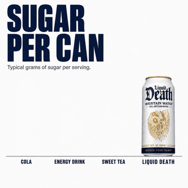

*Four seconds of example 4, as a GIF so it moves without a click. Everything else on this page is a still or a clip you press play on.*

## What the run taught the skill

Three things came out of these renders that were not in the skill before, and are now:

1. **The still IS frame one.** On this API a start image is the literal first frame, so a beat
   list that says an element is *absent at 0.0s* when it is present in the still cannot be
   obeyed literally. On four of six such prompts the model showed the reference for a few
   frames, then cut to the described opening state and built forward. That head is 3–13 frames
   long and trims cleanly; every clip below that used this pattern was trimmed at the cut and
   nothing else. On the other two the model instead **duplicated** the element — a second answer
   card, a second set of labels — and the fix that worked on three of three retakes was to name
   the vanish: *"0.0–0.3s — the cards vanish cleanly, then…"* rather than pretending they were
   never there.
2. **Text-bearing elements must be in the still.** We tried the alternative — a still edited to
   the opening state, with the cards described in the prompt — and the model re-lettered:
   "aluminum" became "aluminium", a line break marker was rendered as a literal slash, a label
   came back as "Screen Mones". When the same elements were in the still and merely vanished
   and returned, they came back pixel-true. So: if it carries words, keep it in the picture.
3. **Text-free reveals are best from an opening-state still.** The scratch ticket is the proof:
   the foil is intact in the still, the prompt says what each cell reveals, and there is no
   head to trim because the still already *is* the opening frame. Icons and short labels
   rendered from the prompt alone were legible; a paragraph would not have been.

The eval this skill could not claim before — **does printed text survive our render path at
720p** — has now been run: thirteen renders across a UI screenshot, a flat infographic and five
photographic stills, and every string that was in the still was legible and correctly spelled
in the last frame. Waits ran 154–385 seconds per 8–10 second clip. Details in [evals.md](evals.md).

---

### 1. App dashboard → the cards pop in, the chart draws

**You type:** `Animate this dashboard screenshot for the launch post — I want the KPI cards to pop in one after another, then the chart to draw itself. The sidebar and every label stay put.`

A product screenshot becomes a launch clip for X, LinkedIn or Product Hunt. UI class. The still was generated with `chatgpt-image-ad`; a real screenshot works the same way.

`seedance-2.5` · 720p · 16:9 · 8s · rendered 2026-08-15 UTC · priced live through `POST /v1/estimates` before the run.

*Left, the still we sent. Right, the last frame it came back as. Click to compare at full size. Read the right half against the left: every label, axis figure and percentage is where it was. Only the cards' entrance and the chart's draw happened.*

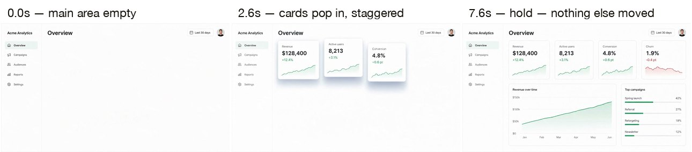

- **0.0s** — the main area is empty; sidebar, title and date pill already in place
- **2.6s** — the four KPI cards scale in with a soft overshoot, a fifth of a second apart, then the chart card fades in and the green line draws left to right
- **7.6s** — everything holds; the camera has not moved a pixel

https://github.com/user-attachments/assets/cc564765-59e9-449d-95b7-9a940ba5f63b

The prompt the skill wrote (2,815 characters — <a href="../../assets/gallery/image-to-motion/01-dashboard-cards-pop-in/prompt.md">full text</a>) · pattern: absent-then-build

<pre>
Locked-off screen capture of the Acme Analytics dashboard in the reference image, a flat light-theme SaaS web app interface. Illustrated flat UI, not photographic. A silent motion graphic with no spoken dialogue, no voice-over and no music.

CAMERA: The camera is locked off and never moves: no pan, no tilt, no zoom, no push-in, no orbit, no drift. Lighting is constant; the white background never changes.

The referen

… 2,815 characters total
</pre>

Files: [`source.jpg`](../../assets/gallery/image-to-motion/01-dashboard-cards-pop-in/source.jpg) · [`source-vs-final.jpg`](../../assets/gallery/image-to-motion/01-dashboard-cards-pop-in/source-vs-final.jpg) · [`beats.jpg`](../../assets/gallery/image-to-motion/01-dashboard-cards-pop-in/beats.jpg) · [`prompt.md`](../../assets/gallery/image-to-motion/01-dashboard-cards-pop-in/prompt.md) · [`meta.json`](../../assets/gallery/image-to-motion/01-dashboard-cards-pop-in/meta.json)

---

### 2. Story hero → the question card, the answer card, then SHOP NOW

**You type:** `Turn this Story still into the Story itself: the question card pops in, then the answer, then the SHOP NOW pill lands. The landscape and the can never move.`

A finished 9:16 static (pack template T20) becomes the Stories/Reels placement of the same creative. Marketing-hero class — the layout every other still here inherits from.

`seedance-2.5` · 720p · 9:16 · 8s · rendered 2026-08-15 UTC · priced live through `POST /v1/estimates` before the run.

<a href="../../assets/gallery/image-to-motion/02-story-card-pop-in/source-vs-final.jpg">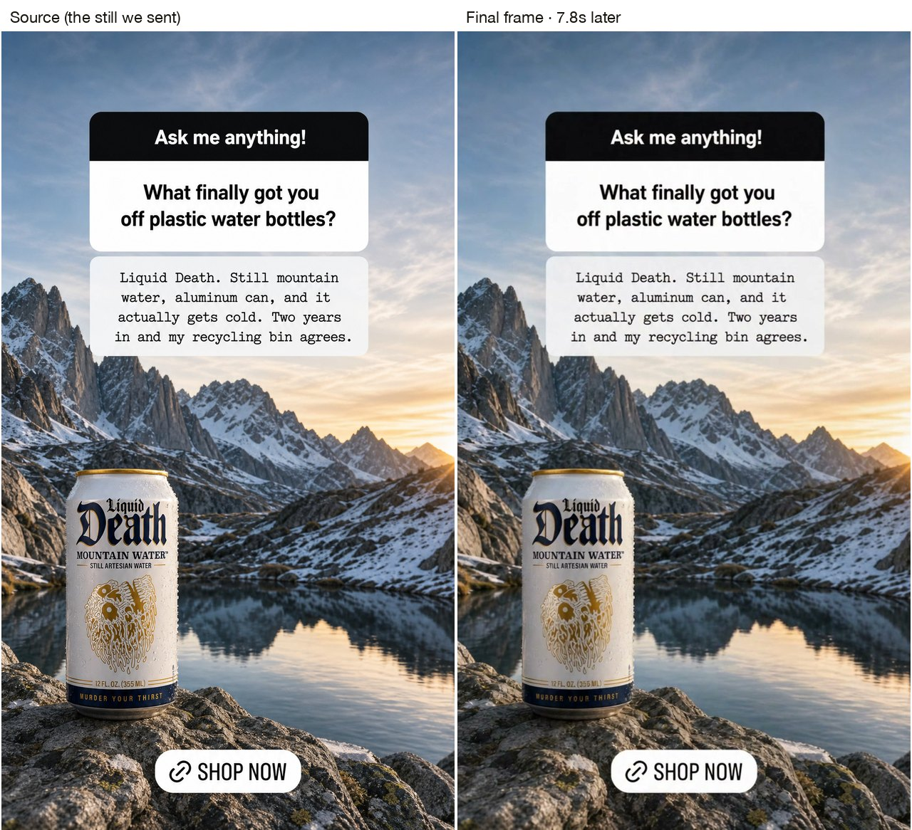</a>

*Left, the still we sent. Right, the last frame it came back as. Click to compare at full size. The overlays were in the still we sent, so they come back letter-perfect: the typewriter answer, the two-line question, the pill. Compare the small text on the can too.*

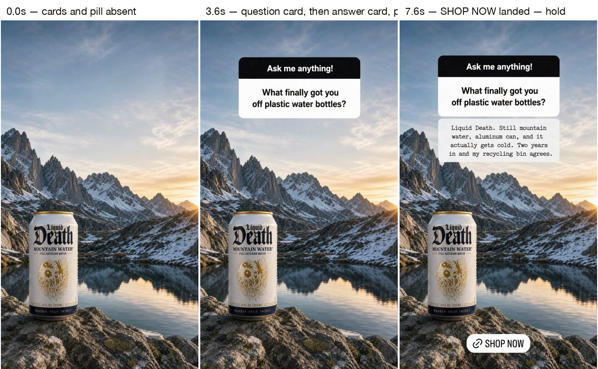

- **0.0s** — landscape and can only; the two cards and the pill are gone
- **3.6s** — the question card pops in, then the answer card a beat behind, each with its own overshoot
- **7.6s** — SHOP NOW has risen into place; hold

https://github.com/user-attachments/assets/86c7e180-2ffc-4428-8411-6125e0b4f124

The prompt the skill wrote (2,464 characters — <a href="../../assets/gallery/image-to-motion/02-story-card-pop-in/prompt.md">full text</a>) · pattern: vanish-then-return

<pre>
Locked-off vertical shot of the reference image: a Liquid Death can standing on a granite rock in front of a snow-capped mountain lake at golden hour, with a black-and-white "Ask me anything!" question card, a typewriter-font answer card, and a white "SHOP NOW" pill. Photographic, not illustrated. A silent motion graphic with no spoken dialogue, no voice-over and no music.

CAMERA: The camera is locked off and never

… 2,464 characters total
</pre>

Files: [`source.jpg`](../../assets/gallery/image-to-motion/02-story-card-pop-in/source.jpg) · [`source-vs-final.jpg`](../../assets/gallery/image-to-motion/02-story-card-pop-in/source-vs-final.jpg) · [`beats.jpg`](../../assets/gallery/image-to-motion/02-story-card-pop-in/beats.jpg) · [`prompt.md`](../../assets/gallery/image-to-motion/02-story-card-pop-in/prompt.md) · [`meta.json`](../../assets/gallery/image-to-motion/02-story-card-pop-in/meta.json)

---

### 3. Packshot → one light sweep, the caption returns

**You type:** `Give me a hero clip of this can: keep it exactly where it is, sweep one highlight across the label, then bring the caption back. No zoom.`

A studio packshot becomes the catalog or hero video with the label untouched. Product class. Locked framing is the point: the can is the same size in the first frame and the last.

`seedance-2.5` · 720p · 1:1 · 8s · rendered 2026-08-15 UTC · priced live through `POST /v1/estimates` before the run.

<a href="../../assets/gallery/image-to-motion/03-packshot-light-sweep/source-vs-final.jpg">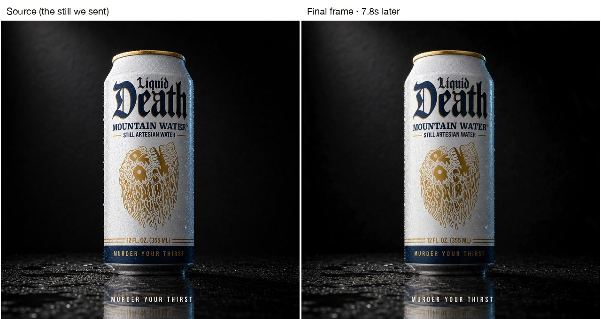</a>

*Left, the still we sent. Right, the last frame it came back as. Click to compare at full size. The can's outline and label match the source to the pixel; the only changes are a moving specular on the foil and the caption's return.*

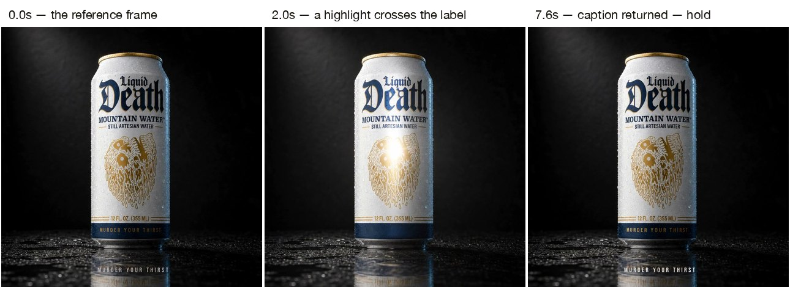

- **0.0s** — the reference frame, key light constant
- **2.0s** — a single narrow highlight crosses the label left to right; the label itself does not move
- **7.6s** — MURDER YOUR THIRST is back at the bottom; hold

https://github.com/user-attachments/assets/369d5de4-8f5f-4150-bc5a-41b9113da5cc

The prompt the skill wrote (1,924 characters — <a href="../../assets/gallery/image-to-motion/03-packshot-light-sweep/prompt.md">full text</a>) · pattern: vanish-then-return

<pre>
Locked-off studio packshot of the reference image: a Liquid Death can standing on wet black slate against a charcoal-black backdrop, keyed from the upper left, with the caption "MURDER YOUR THIRST" at the bottom. Photographic, not illustrated. A silent motion graphic with no spoken dialogue, no voice-over and no music.

CAMERA: The camera is locked off and never moves: no pan, no tilt, no zoom, no push-in, no orbit,

… 1,924 characters total
</pre>

Files: [`source.jpg`](../../assets/gallery/image-to-motion/03-packshot-light-sweep/source.jpg) · [`source-vs-final.jpg`](../../assets/gallery/image-to-motion/03-packshot-light-sweep/source-vs-final.jpg) · [`beats.jpg`](../../assets/gallery/image-to-motion/03-packshot-light-sweep/beats.jpg) · [`prompt.md`](../../assets/gallery/image-to-motion/03-packshot-light-sweep/prompt.md) · [`meta.json`](../../assets/gallery/image-to-motion/03-packshot-light-sweep/meta.json)

---

### 4. Stat card → the bars grow, the 0g pops

**You type:** `I want the bars on this chart to grow one by one while the can and the headline stay put, then the 0g pops in over the can.`

A data-led static becomes a data-led video. Chart/stat class — the one the description calls "the bars slide up". Small in the wild, concentrated in fintech and B2B.

`seedance-2.5` · 720p · 1:1 · 8s · rendered 2026-08-15 UTC · priced live through `POST /v1/estimates` before the run.

<a href="../../assets/gallery/image-to-motion/04-bar-chart-bars-grow/source-vs-final.jpg">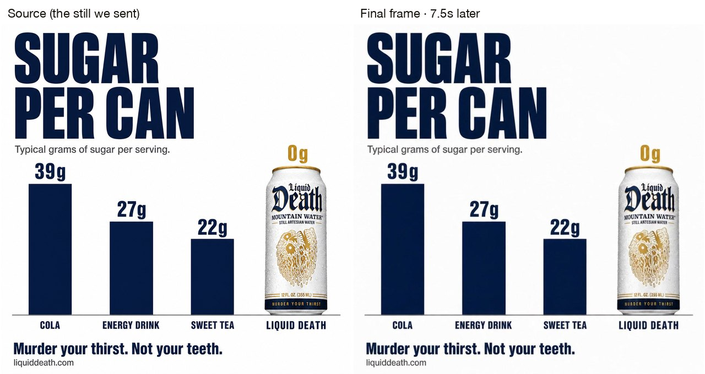</a>

*Left, the still we sent. Right, the last frame it came back as. Click to compare at full size. Every value label lands exactly where it was printed. The bars are drawn approximately, as the still's own template documents; the numbers are the claim.*

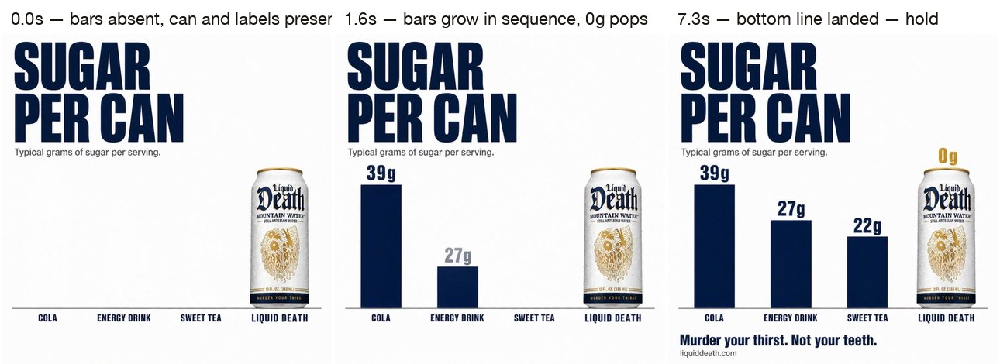

- **0.0s** — headline, subline, category labels and the can are present; no bars
- **1.6s** — COLA, then ENERGY DRINK, then SWEET TEA grow from the baseline; the gold 0g pops in over the can
- **7.3s** — the bottom line has risen in; hold

https://github.com/user-attachments/assets/02a50dc3-fcc4-47d6-96db-c7ce72069609

The prompt the skill wrote (2,328 characters — <a href="../../assets/gallery/image-to-motion/04-bar-chart-bars-grow/prompt.md">full text</a>) · pattern: absent-then-build

<pre>
Locked-off flat graphic of the reference image: a white data-led ad with the headline "SUGAR PER CAN", a four-column bar chart in navy with a Liquid Death can standing in the fourth column under a gold "0g", and a bold line at the bottom. Flat illustrated infographic, not photographic. A silent motion graphic with no spoken dialogue, no voice-over and no music.

CAMERA: The camera is locked off and never moves: no pa

… 2,328 characters total
</pre>

Files: [`source.jpg`](../../assets/gallery/image-to-motion/04-bar-chart-bars-grow/source.jpg) · [`source-vs-final.jpg`](../../assets/gallery/image-to-motion/04-bar-chart-bars-grow/source-vs-final.jpg) · [`beats.jpg`](../../assets/gallery/image-to-motion/04-bar-chart-bars-grow/beats.jpg) · [`prompt.md`](../../assets/gallery/image-to-motion/04-bar-chart-bars-grow/prompt.md) · [`meta.json`](../../assets/gallery/image-to-motion/04-bar-chart-bars-grow/meta.json)

---

### 5. Flat-lay → the callout lines draw, one light sweep

**You type:** `Animate this desk-kit flat-lay: each white callout line draws out from its object and its label lands, one at a time, then a slow light sweep across the slate. Nothing on the desk moves.`

An annotated product flat-lay (pack template T36) becomes a feature-callout video. Flat-lay class; also the small-label stress test.

`seedance-2.5` · 720p · 1:1 · 8s · rendered 2026-08-15 UTC · priced live through `POST /v1/estimates` before the run.

<a href="../../assets/gallery/image-to-motion/05-desk-kit-callouts-draw/source-vs-final.jpg">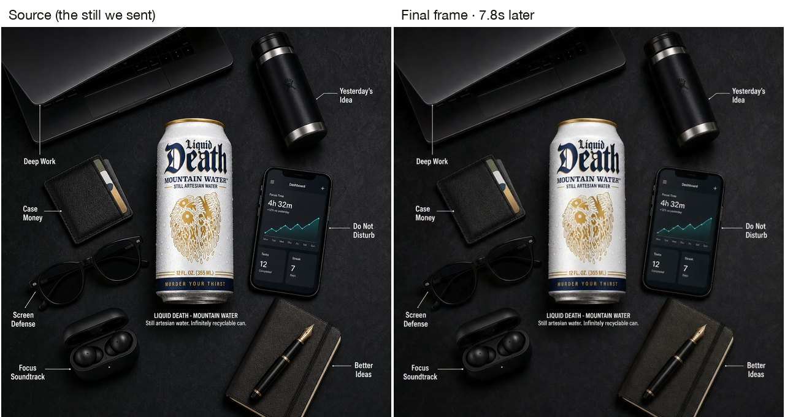</a>

*Left, the still we sent. Right, the last frame it came back as. Click to compare at full size. Seven labels, seven positions, all back where they were printed. Read the phone screen and the two-line caption under the can at full size.*

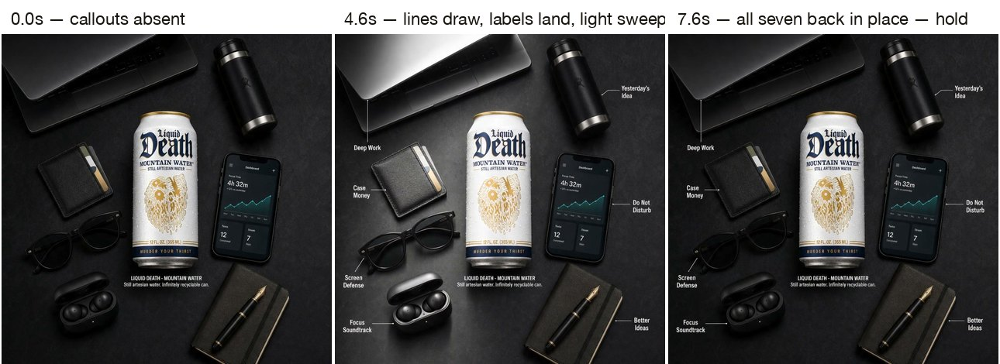

- **0.0s** — objects, can and caption; no callouts
- **4.6s** — the lines draw and the labels land in sequence while the light band crosses the slate
- **7.6s** — all seven callouts back in place; hold

https://github.com/user-attachments/assets/dd1cf87d-fe9b-439e-8c69-7f702e149ff6

The prompt the skill wrote (2,945 characters — <a href="../../assets/gallery/image-to-motion/05-desk-kit-callouts-draw/prompt.md">full text</a>) · pattern: vanish-then-return

<pre>
Locked-off overhead flat-lay of the reference image: a Liquid Death can centred on black slate, surrounded by a laptop, a black insulated bottle, a card wallet, black sunglasses, wireless earbuds in their case, a phone showing a dark "Dashboard" app screen, and a black notebook with a fountain pen, with thin white callout lines and labels. Photographic, not illustrated. A silent motion graphic with no spoken dialogue

… 2,945 characters total
</pre>

Files: [`source.jpg`](../../assets/gallery/image-to-motion/05-desk-kit-callouts-draw/source.jpg) · [`source-vs-final.jpg`](../../assets/gallery/image-to-motion/05-desk-kit-callouts-draw/source-vs-final.jpg) · [`beats.jpg`](../../assets/gallery/image-to-motion/05-desk-kit-callouts-draw/beats.jpg) · [`prompt.md`](../../assets/gallery/image-to-motion/05-desk-kit-callouts-draw/prompt.md) · [`meta.json`](../../assets/gallery/image-to-motion/05-desk-kit-callouts-draw/meta.json)

---

### 6. Scratch-off ticket → the coin scrapes six cells, in order

**You type:** `Animate this scratch-off ticket: the coin scratches every cell one after another and the icons underneath appear. All the printed text stays frozen.`

The reveal that a still cannot show. The still we sent has the foil intact (pack template T31, edited to that state with `POST /v1/images` and `sourceAssetId`), and the prompt describes what each cell reveals. Flat-lay class; the opening-state pattern.

`seedance-2.5` · 720p · 3:4 · 10s · rendered 2026-08-15 UTC · priced live through `POST /v1/estimates` before the run. The still is 2:3; the API fitted it to the 3:4 ask with content-safe padding.

<a href="../../assets/gallery/image-to-motion/06-scratch-ticket-reveal/source-vs-final.jpg">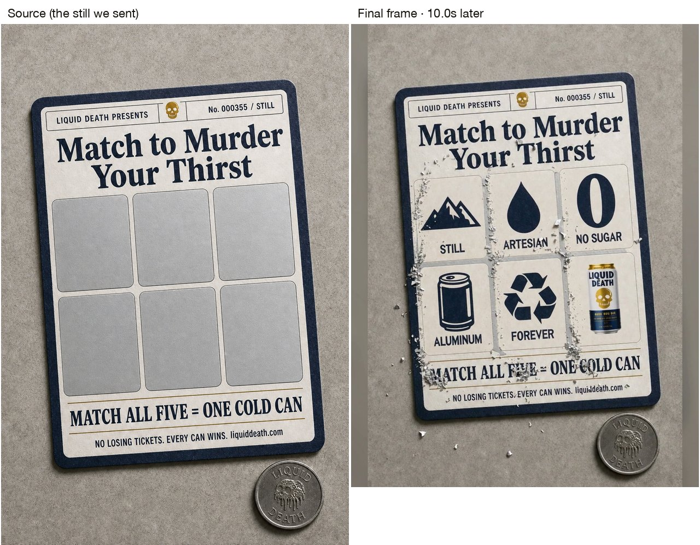</a>

*Left, the still we sent. Right, the last frame it came back as. Click to compare at full size. Nothing under the foil existed in the still. The five icons, their labels and the small can photograph were rendered from the prompt alone, and every printed line on the ticket held.*

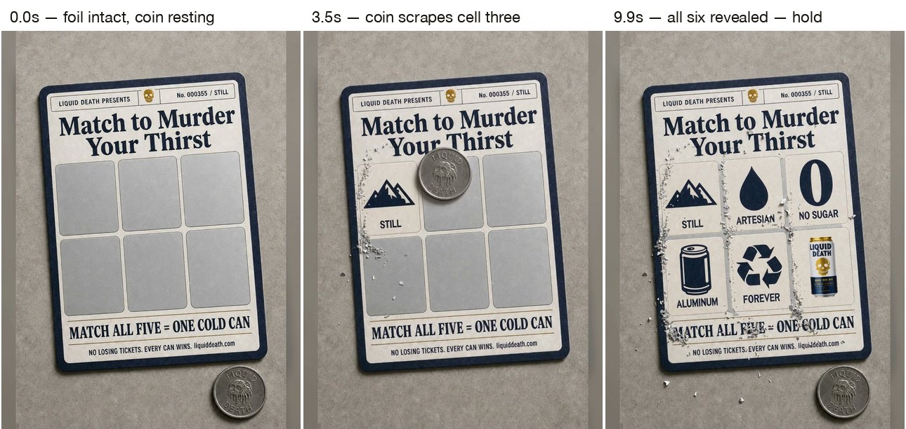

- **0.0s** — six intact silver cells, coin resting outside the ticket
- **3.5s** — the coin, on edge, scrapes cell three; STILL and ARTESIAN already revealed, flakes on the concrete
- **9.9s** — all six revealed, coin back at rest; hold

https://github.com/user-attachments/assets/6e8d211f-9843-4ebc-bd25-396c91e67392

The prompt the skill wrote (2,637 characters — <a href="../../assets/gallery/image-to-motion/06-scratch-ticket-reveal/prompt.md">full text</a>) · pattern: opening-state still

<pre>
Locked-off overhead flat-lay of the reference image: a printed Liquid Death scratch-off ticket lying at a slight tilt on pale concrete, its six cells covered in intact matte silver foil, and a silver Liquid Death coin resting flat at the lower right. Photographic, not illustrated. A silent motion graphic with no spoken dialogue, no voice-over and no music.

CAMERA: The camera is locked off and never moves: no pan, no

… 2,637 characters total
</pre>

Files: [`source.jpg`](../../assets/gallery/image-to-motion/06-scratch-ticket-reveal/source.jpg) · [`source-vs-final.jpg`](../../assets/gallery/image-to-motion/06-scratch-ticket-reveal/source-vs-final.jpg) · [`beats.jpg`](../../assets/gallery/image-to-motion/06-scratch-ticket-reveal/beats.jpg) · [`prompt.md`](../../assets/gallery/image-to-motion/06-scratch-ticket-reveal/prompt.md) · [`meta.json`](../../assets/gallery/image-to-motion/06-scratch-ticket-reveal/meta.json)

---

### 7. Before/after split → the cans drop in, the ice settles

**You type:** `Make the right panel happen: the four cans drop in one by one, then the ice cubes slide into place. The left panel and both headlines never move.`

A two-panel static (pack template T13) becomes a reveal. Kept last on purpose: before/after is the rarest motion-graphic shape in the live Ad Library sample and nobody asked for it in the harvest — it is here because it works, not because it leads.

`seedance-2.5` · 720p · 1:1 · 8s · rendered 2026-08-15 UTC · priced live through `POST /v1/estimates` before the run.

<a href="../../assets/gallery/image-to-motion/07-before-after-cans-land/source-vs-final.jpg">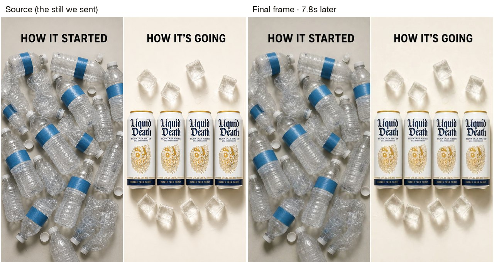</a>

*Left, the still we sent. Right, the last frame it came back as. Click to compare at full size. Left panel identical, both headlines identical, four cans landed where they were printed. The mid-drop can is motion-blurred, which is what a real drop looks like.*

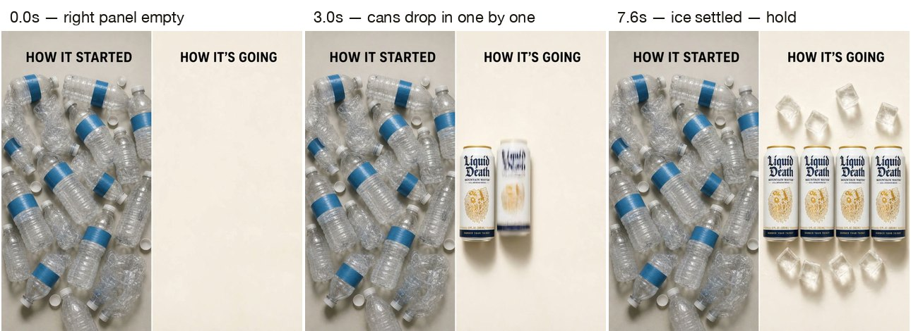

- **0.0s** — right panel is empty cream; the left panel is complete
- **3.0s** — cans drop in from above one after another, shadows catching up late
- **7.6s** — ice cubes settled; hold

https://github.com/user-attachments/assets/a0407180-27e0-4183-a1ee-4545a18ba568

The prompt the skill wrote (1,997 characters — <a href="../../assets/gallery/image-to-motion/07-before-after-cans-land/prompt.md">full text</a>) · pattern: absent-then-build

<pre>
Locked-off overhead two-panel flat-lay of the reference image: on the left, "HOW IT STARTED" over a pile of crushed clear plastic bottles on grey card; on the right, "HOW IT'S GOING" over four Liquid Death cans in a row with ice cubes above and below on cream card. Photographic, not illustrated. A silent motion graphic with no spoken dialogue, no voice-over and no music.

CAMERA: The camera is locked off and never mo

… 1,997 characters total
</pre>

Files: [`source.jpg`](../../assets/gallery/image-to-motion/07-before-after-cans-land/source.jpg) · [`source-vs-final.jpg`](../../assets/gallery/image-to-motion/07-before-after-cans-land/source-vs-final.jpg) · [`beats.jpg`](../../assets/gallery/image-to-motion/07-before-after-cans-land/beats.jpg) · [`prompt.md`](../../assets/gallery/image-to-motion/07-before-after-cans-land/prompt.md) · [`meta.json`](../../assets/gallery/image-to-motion/07-before-after-cans-land/meta.json)

---

## How to make one of these yourself

1. Put the still in `references/` and say what should move: name the element and the order,
   in plain seconds. *"The cards pop in one after another, then the chart draws"* is enough.
2. If something should **appear** during the clip: keep it in the still if it carries text, and
   let the skill name the vanish; if it carries no text, hand the skill an opening-state still
   (the pack's `chatgpt-image-ad` edit path makes one from the finished ad in one call).
3. The skill prices the exact configuration first and waits for a yes. Four takes is four
   charges, said out loud before the first one.
4. Read every string back at full size before you call it done. The pairs above are how.

Everything the skill knows is in [SKILL.md](SKILL.md); what it has proven is in [evals.md](evals.md).
